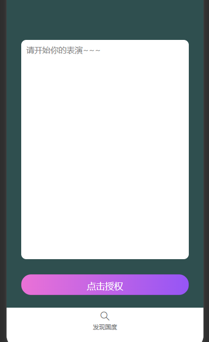
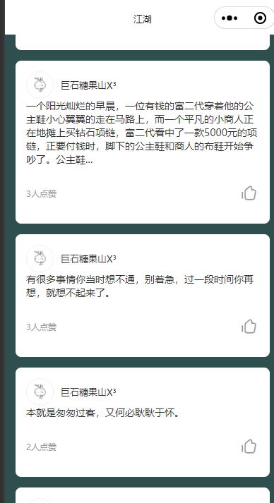

### 准备工作
小程序：吐槽树洞国
首页：发表吐槽
我的：吐槽国度列表

### 部署:
打包二进制文件
set GOARCH=amd64
set GOOS=linux
go build -o tcsd-api main.go

### config/config.toml配置
mysql 链接地址
mini_program 小程序配置

执行 tcsd.sql 文件

nginx/ssl

